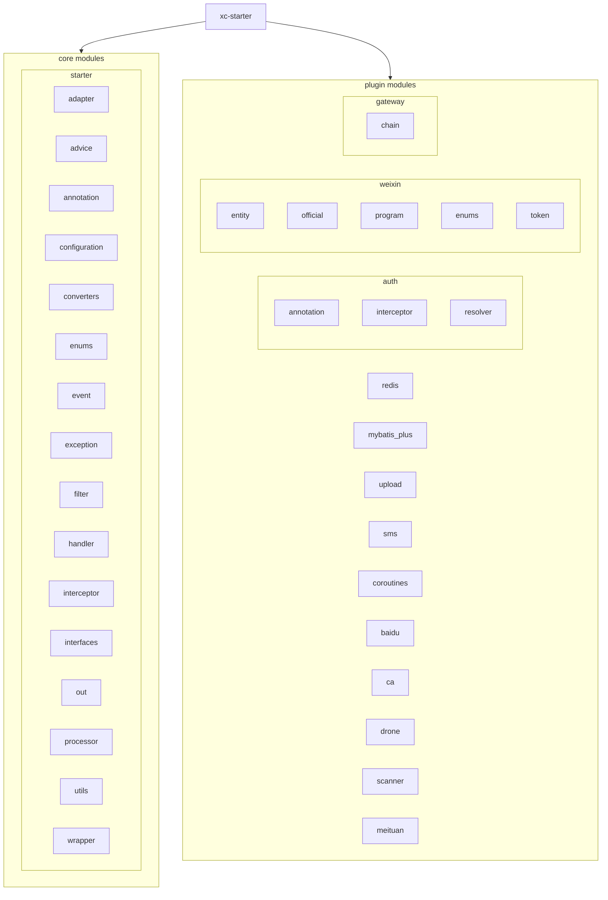

# xc-starter 项目

## 项目摘要

xc-starter 是一个基于 Spring Boot 的企业级开发工具包，提供了丰富的插件化功能模块。该项目旨在简化企业应用开发，提供了一套完整的解决方案，包括认证授权、微信开发、网关路由、数据处理等核心功能。

### 核心功能
1. **认证与授权**：提供了基于 Token 的认证机制和权限控制
2. **微信开发工具包**：封装了微信公众号和小程序的 API 接口
3. **网关路由**：实现了可扩展的网关链式处理机制
4. **Redis 扩展**：提供了 Redis 相关的工具类和配置
5. **MyBatis Plus 扩展**：增强了 MyBatis Plus 的功能
6. **文件上传**：支持多种文件上传方式
7. **短信服务**：集成了短信发送功能
8. **协程支持**：提供了 Kotlin 协程的支持

## 架构总览

## 模块索引

| 模块路径 | 职责 |
| :--- | :--- |
| `fun.fan.xc.starter` | 核心启动模块 |
| `fun.fan.xc.starter.adapter` | 适配器模块 |
| `fun.fan.xc.starter.advice` | 异常处理模块 |
| `fun.fan.xc.starter.annotation` | 注解模块 |
| `fun.fan.xc.starter.configuration` | 配置模块 |
| `fun.fan.xc.starter.converters` | 转换器模块 |
| `fun.fan.xc.starter.enums` | 枚举模块 |
| `fun.fan.xc.starter.event` | 事件处理模块 |
| `fun.fan.xc.starter.exception` | 异常处理模块 |
| `fun.fan.xc.starter.filter` | 过滤器模块 |
| `fun.fan.xc.starter.handler` | 处理器模块 |
| `fun.fan.xc.starter.interceptor` | 拦截器模块 |
| `fun.fan.xc.starter.interfaces` | 接口定义模块 |
| `fun.fan.xc.starter.out` | 输出处理模块 |
| `fun.fan.xc.starter.processor` | 处理器模块 |
| `fun.fan.xc.starter.utils` | 工具类模块 |
| `fun.fan.xc.starter.wrapper` | 包装器模块 |
| `fun.fan.xc.plugin.auth` | 认证授权模块 |
| `fun.fan.xc.plugin.weixin` | 微信开发工具包模块 |
| `fun.fan.xc.plugin.gateway` | 网关路由模块 |
| `fun.fan.xc.plugin.redis` | Redis 扩展模块 |
| `fun.fan.xc.plugin.mybatis_plus` | MyBatis Plus 扩展模块 |
| `fun.fan.xc.plugin.upload` | 文件上传模块 |
| `fun.fan.xc.plugin.sms` | 短信服务模块 |
| `fun.fan.xc.plugin.coroutines` | 协程支持模块 |
| `fun.fan.xc.plugin.baidu` | 百度相关功能模块 |
| `fun.fan.xc.plugin.ca` | 证书管理模块 |
| `fun.fan.xc.plugin.drone` | 无人机相关模块 |
| `fun.fan.xc.plugin.scanner` | 扫描器模块 |
| `fun.fan.xc.plugin.meituan` | 美团相关功能模块 |

## 运行与开发

### 环境要求
- Java 8+
- Kotlin 1.9.23
- Maven 3.x
- Spring Boot 2.7.15

### 依赖管理
- 使用 Maven 进行依赖管理
- 核心依赖包括 Spring Boot Web、FastJSON2、Hutool、Guava 等

### 配置方式
- 通过 `application.yml` 或 `application.properties` 配置相关参数

## 测试策略

从代码分析来看，该项目目前没有包含专门的测试类或测试配置。建议补充以下测试：

### 单元测试
- 对各个模块的核心功能进行单元测试
- 对工具类进行测试

### 集成测试
- 对插件模块进行集成测试
- 对核心功能进行端到端测试

## 编码规范

### 语言规范
- 项目采用 Kotlin 和 Java 混合编写，充分利用两种语言的优势
- 核心业务逻辑主要使用 Kotlin 编写，以利用其简洁性和空安全特性
- 部分组件和接口定义使用 Java 编写，以保持与 Spring 生态的兼容性

### 代码风格
- 使用 Lombok 简化实体类代码
- 使用 Spring Boot 的注解进行依赖注入和配置
- 遵循 RESTful API 设计规范

### 异常处理
- 使用自定义异常类 `XcServiceException` 处理业务异常

## AI 使用指引

### 代码理解
- 在分析代码时，需要注意项目使用 Kotlin 和 Java 混合编写，应同时读取 .java 和 .kt 文件
- 可以利用 AI 快速理解各模块的功能和实现方式
- 可以帮助分析复杂的业务逻辑

### 代码生成
- 可以根据需求自动生成新的模块代码
- 可以生成测试用例和测试数据

### 代码优化
- 可以分析现有代码的性能瓶颈并提出优化建议
- 可以帮助重构复杂的业务逻辑

## 变更记录 (Changelog)

- **2025-09-09**: 完成对 xc-starter 项目的初步分析，梳理了项目结构、核心功能和架构设计。
- **2025-09-10**: 更新项目说明文件，修正架构图和模块索引信息。