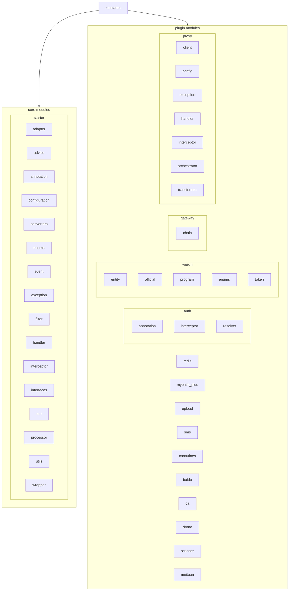

# xc-starter

# xc-starter

xc-starter 是一个基于 Spring Boot 的企业级开发工具包，旨在简化企业应用开发，提供了一套完整的解决方案。通过插件化的设计，开发者可以按需引入所需功能模块，快速构建稳定、高效的应用系统。

## 项目特色

- **插件化设计**：模块化架构，按需引入所需功能模块
- **混合编程**：Kotlin 和 Java 混合编写，充分发挥两种语言优势
- **企业级解决方案**：提供完整的企业应用开发解决方案
- **易于集成**：与 Spring Boot 生态无缝集成
- **灵活配置**：支持多种配置方式，满足不同场景需求

## 架构概览



## 模块介绍

| 模块路径 | 职责 |
| :--- | :--- |
| `fun.fan.xc.starter` | 核心启动模块 |
| `fun.fan.xc.starter.adapter` | 适配器模块 |
| `fun.fan.xc.starter.advice` | 异常处理模块 |
| `fun.fan.xc.starter.annotation` | 注解模块 |
| `fun.fan.xc.starter.configuration` | 配置模块 |
| `fun.fan.xc.starter.converters` | 转换器模块 |
| `fun.fan.xc.starter.enums` | 枚举模块 |
| `fun.fan.xc.starter.event` | 事件处理模块 |
| `fun.fan.xc.starter.exception` | 异常处理模块 |
| `fun.fan.xc.starter.filter` | 过滤器模块 |
| `fun.fan.xc.starter.handler` | 处理器模块 |
| `fun.fan.xc.starter.interceptor` | 拦截器模块 |
| `fun.fan.xc.starter.interfaces` | 接口定义模块 |
| `fun.fan.xc.starter.out` | 输出处理模块 |
| `fun.fan.xc.starter.processor` | 处理器模块 |
| `fun.fan.xc.starter.utils` | 工具类模块 |
| `fun.fan.xc.starter.wrapper` | 包装器模块 |
| `fun.fan.xc.plugin.auth` | 认证授权模块 |
| `fun.fan.xc.plugin.weixin` | 微信开发工具包模块 |
| `fun.fan.xc.plugin.gateway` | 网关路由模块 |
| `fun.fan.xc.plugin.redis` | Redis 扩展模块 |
| `fun.fan.xc.plugin.mybatis_plus` | MyBatis Plus 扩展模块 |
| `fun.fan.xc.plugin.upload` | 文件上传模块 |
| `fun.fan.xc.plugin.sms` | 短信服务模块 |
| `fun.fan.xc.plugin.coroutines` | 协程支持模块 |
| `fun.fan.xc.plugin.baidu` | 百度相关功能模块 |
| `fun.fan.xc.plugin.ca` | 证书管理模块 |
| `fun.fan.xc.plugin.drone` | 无人机相关模块 |
| `fun.fan.xc.plugin.scanner` | 扫描器模块 |
| `fun.fan.xc.plugin.meituan` | 美团相关功能模块 |
| `fun.fan.xc.plugin.proxy` | 代理服务模块 |

## 快速开始

### 环境要求

- Java 8+
- Kotlin 1.9.23
- Maven 3.x
- Spring Boot 2.7.15

### 依赖管理

使用 Maven 进行依赖管理，在 `pom.xml` 中添加所需模块依赖：

```xml
<dependency>
    <groupId>fun.fan.xc</groupId>
    <artifactId>xc-starter</artifactId>
    <version>1.0.0</version>
</dependency>

<!-- 按需引入插件模块 -->
<dependency>
    <groupId>fun.fan.xc.plugin</groupId>
    <artifactId>auth</artifactId>
    <version>1.0.0</version>
</dependency>
```

### 配置方式

通过 `application.yml` 或 `application.properties` 配置相关参数：

```yaml
xc:
  authentication:
    default:
      token-name: Authorization
      expires: 2h
```

### 编译命令

```bash
# 编译项目
./mvnw -q -DskipTests package
```

## 使用示例

以认证授权模块为例，展示如何使用 xc-starter：

### 启用认证模块

在Spring Boot启动类上添加`@EnableAuth`注解：

```java
@SpringBootApplication
@EnableAuth
public class Application {
    public static void main(String[] args) {
        SpringApplication.run(Application.class, args);
    }
}
```

### 配置认证参数

在 `application.yml` 中添加认证相关配置：

```yaml
xc:
  authentication:
    default: # 配置名，需要与XcAuthInterface实现的client()方法返回值一致
      token-name: Authorization # 请求中携带Token的Header名称
      expires: 2h # Token过期时间
      user-cache: true # 是否缓存用户信息
      user-cache-expires: 30m # 用户信息缓存过期时间
      path: # 需要拦截的路径
        - /**
```

### 创建用户实体

创建用户实体类并实现 `XcBaseUser` 接口：

```java
@Data
@Accessors(chain = true)
public class UserEntity implements XcBaseUser {
    private String id;
    private String name;

    // Token字段，不需要存入数据库
    @TableField(exist = false)
    private String token;

    // 客户端字段，不需要存入数据库
    @TableField(exist = false)
    private String client = "default";

    @Override
    public String getAccount() {
        return id;
    }

    @Override
    public String getName() {
        return name;
    }

    // getter和setter方法...
}
```

### 实现认证接口

实现 `XcAuthInterface` 接口提供用户认证逻辑：

```java
@Component
public class XcAuth implements XcAuthInterface {
    @Override
    public String client() {
        return "default";
    }

    @Override
    public boolean checkUser(XcBaseUser user) {
        // 校验用户是否有效
        return user != null;
    }

    @Override
    public Set<String> selectPermissions(XcBaseUser user) {
        // 获取用户权限列表
        return null; // 如果不需要权限校验，可以返回null
    }

    @Override
    public XcBaseUser select(String account) {
        // 根据account查询用户信息
        return null; // 实际开发中需要实现用户查询逻辑
    }
}
```

### 使用认证功能

在控制器中使用认证功能：

```java
@RestController
@RequestMapping("/api")
public class ApiController {

    @GetMapping("/user/info")
    public R<UserEntity> getUserInfo(@AuthUser XcBaseUser user) {
        // @AuthUser注解用于参数注入已登录用户信息
        return R.success((UserEntity) user);
    }

    @GetMapping("/public/info")
    @AuthIgnore
    public R<String> getPublicInfo() {
        // @AuthIgnore注解用于标识忽略认证检查的接口
        return R.success("公共信息");
    }

    @GetMapping("/admin/users")
    @AuthPermission(permission = "user:manage")
    public R<List<UserEntity>> getUsers(@AuthUser XcBaseUser user) {
        // @AuthPermission注解用于权限校验
        return R.success(new ArrayList<>());
    }
}
```

## 开发指南

### 编码规范

#### 语言规范
- 项目采用 Kotlin 和 Java 混合编写，充分利用两种语言的优势
- 核心业务逻辑主要使用 Kotlin 编写，以利用其简洁性和空安全特性
- 部分组件和接口定义使用 Java 编写，以保持与 Spring 生态的兼容性

#### 代码风格
- 使用 Lombok 简化实体类代码
- 使用 Spring Boot 的注解进行依赖注入和配置
- 遵循 RESTful API 设计规范

#### 异常处理
- 使用自定义异常类 `XcServiceException` 处理业务异常

### 测试策略

#### 单元测试
- 对各个模块的核心功能进行单元测试
- 对工具类进行测试

#### 集成测试
- 对插件模块进行集成测试
- 对核心功能进行端到端测试

## 模块详细说明

### 认证授权模块 (auth)

认证授权模块提供了基于 Token 的认证机制和权限控制功能。

**核心组件：**
- `@AuthUser`: 用于参数注入已登录用户信息
- `@AuthIgnore`: 用于标识忽略认证检查的接口
- `@AuthPermission`: 用于标识需要特定权限的接口
- `BaseAuthInterceptor`: 基础认证拦截器
- `XcAuthInterface`: 认证接口，需要业务方实现该接口以提供用户认证逻辑
- `AuthUtil`: 认证工具类，提供了 Token 管理等相关功能

**使用方式：**
1. 实现 `XcAuthInterface` 接口，提供用户认证逻辑
2. 在 Spring Boot 启动类上添加 `@EnableAuth` 注解
3. 在需要获取当前用户信息的方法参数中使用 `@AuthUser` 注解

### 微信开发工具包模块 (weixin)

微信开发工具包模块提供了对微信公众号和小程序的全面支持，封装了微信的各种 API 接口。

**核心功能：**
- 认证与授权（公众号 OAuth2 登录、小程序登录）
- 支付功能（统一下单、退款、委托代扣）
- 消息管理（客服消息、模板消息、订阅消息）
- 素材管理（临时素材上传）
- 菜单管理（自定义菜单创建）
- 二维码（公众号带参数二维码、小程序码生成）

**使用方式：**
1. 在 `application.yml` 中配置微信相关参数，配置前缀为 `xc.weixin`
2. 在 Spring Boot 启动类上添加 `@EnableWeiXinApi` 注解
3. 通过依赖注入使用 `OfficialWeiXinApi` 或 `ProgramWeiXinApi` 进行微信 API 调用

### 网关路由模块 (gateway)

网关路由模块提供了可扩展的网关链式处理机制，支持通过责任链模式对请求进行处理。

**核心功能：**
- 链式处理机制，支持通过责任链模式对请求进行处理
- IP 黑白名单检查
- 默认配置了IP黑名单检查链和IP白名单检查链

**使用方式：**
1. 在 Spring Boot 启动类上添加 `@EnableXcGateway` 注解
2. 继承 `AbstractGatewayChain` 类实现自定义处理逻辑

### Redis 扩展模块 (redis)

Redis 扩展模块提供了 Redis 相关的工具类和配置，简化了 Redis 在项目中的使用。

**核心功能：**
- 提供了常用的 Redis 操作方法，如 set、get、delete 等
- 支持字符串、哈希、列表、集合等数据结构操作
- 支持分布式锁功能和 Redis 脚本执行
- 支持消息发布/订阅

**使用方式：**
1. 在 Spring Boot 启动类上添加 `@EnableRedis` 注解
2. 通过依赖注入使用 `Redis` 接口进行 Redis 操作

### 代理服务模块 (proxy)

代理服务模块提供了HTTP代理功能，基于Netty实现，支持负载均衡、连接池管理、请求转发等功能。

**核心功能：**
- HTTP代理，支持将HTTP请求转发到目标服务器
- 负载均衡，支持基于权重的轮询负载均衡算法
- 连接池管理，基于Netty的连接池管理
- 配置化路由，支持通过配置文件定义路由规则

**使用方式：**
1. 在Spring Boot应用的主类上添加`@EnableXcProxy`注解
2. 在`application.yml`中配置路由规则
3. 通过依赖注入使用相关组件

## 目录

- [项目特色](#项目特色)
- [架构概览](#架构概览)
- [模块介绍](#模块介绍)
- [快速开始](#快速开始)
- [使用示例](#使用示例)
- [开发指南](#开发指南)
- [模块详细说明](#模块详细说明)
- [变更记录](#变更记录)

## 变更记录

- **2025-09-22**: 更新项目说明文件，完善架构图和模块索引信息，添加代理服务模块。
- **2025-09-10**: 更新项目说明文件，修正架构图和模块索引信息。
- **2025-09-09**: 完成对 xc-starter 项目的初步分析，梳理了项目结构、核心功能和架构设计。